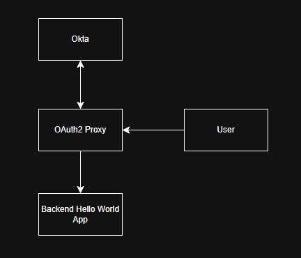

# OAuth2, Okta and Terraform



This project showcases a simple OIDC setup with Okta, and OAuth2, while arranging everything with the Okta Terraform provider. Managing your Okta configuration through terraform gives you the benefits of IAC while saving a huge amount of time for IT admins by being able to speed through repetitive tasks. This repository will serve as my own research and tricks I found with Okta. It will also showcase terraform module usage as well.

## Setup Section and Quick Start Guide

To recreate this you need:
- Okta Integrator or Okta
- Terraform service app to allow Terraform to create things in Okta as well as its: 
    - Client ID
    - KID
- Okta user who is authorized to use the app
- Okta user who is not authorized to use the app


Start by exporting required environment variables for okta provider:

```
export OKTA_ORG_NAME="your org name or integrator prefix"
export OKTA_BASE_URL="okta.com"
export OKTA_API_CLIENT_ID="terraform okta app client id"
export OKTA_API_PRIVATE_KEY_ID="terraform okta app KID"
export OKTA_API_PRIVATE_KEY="private key"
export OKTA_API_SCOPES="okta.groups.manage,okta.users.manage,okta.apps.read"
```

Run terraform plan, init, and apply. From there you are able to suply the environment variables for the docker compose app:

```
OAUTH2_PROXY_CLIENT_ID: ${OAUTH2_PROXY_CLIENT_ID}
OAUTH2_PROXY_CLIENT_SECRET: ${OAUTH2_PROXY_CLIENT_SECRET}

# generate your secret to keep communication with OAuth2 Proxy private
export OAUTH2_PROXY_COOKIE_SECRET=$(openssl rand -base64 32 | head -c 32 | base64)

docker compose up
```

From here you should be able to access your app through the OAuth2 proxy endpoint, it will communicate with Okta and if your Okta user is authorized they are able to see the backend app.